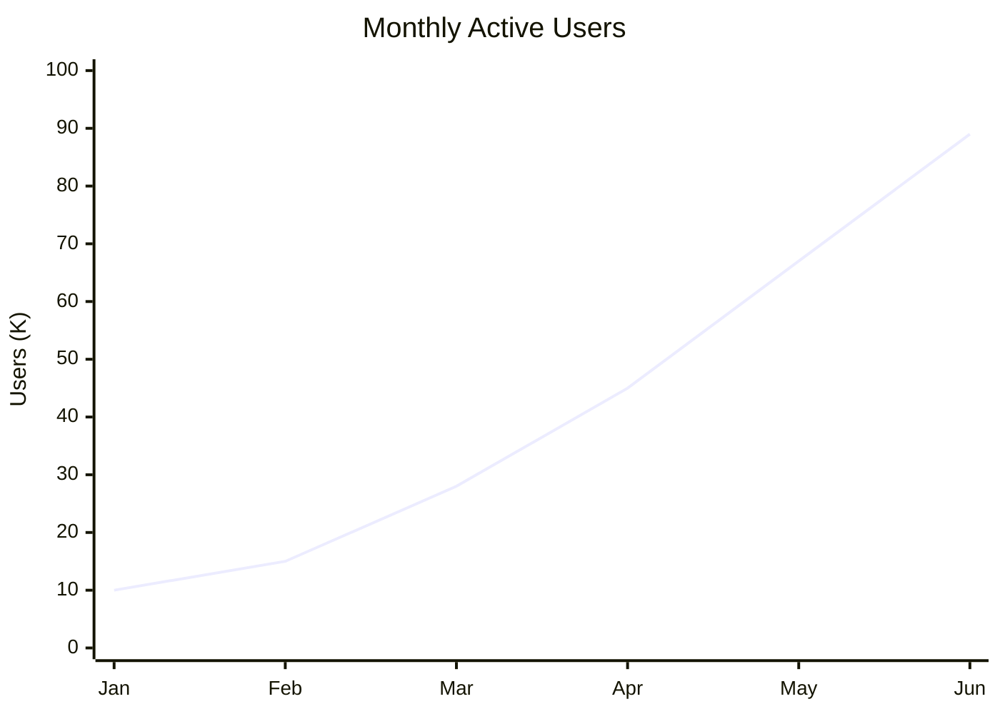
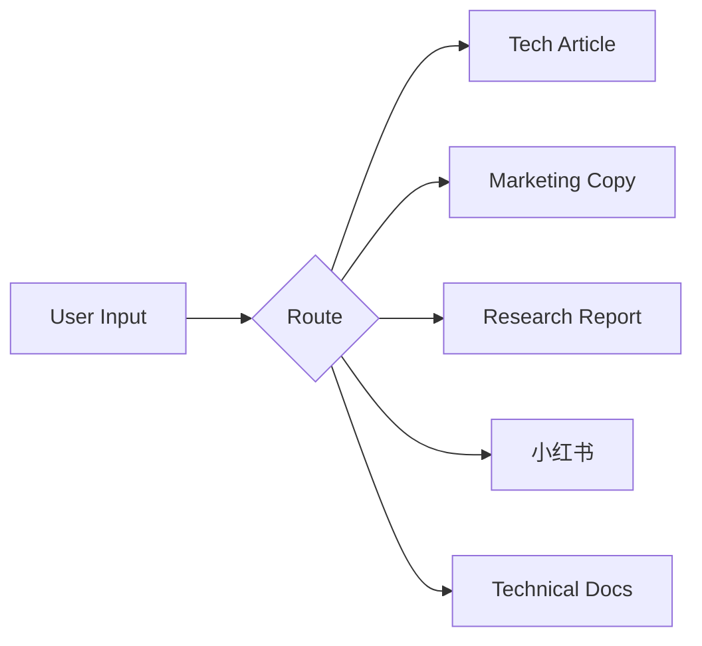

# Visualization — Data Visualization Suggestions

An enhancement module that generates specific, actionable visualization recommendations
for data-rich content. Primarily used with research-report and tech-article modes.

Activated when:
- Phase 2 (Draft) of research-report or tech-article produces data points
- User says "加图表建议" / "add chart suggestions" / "visualize this"
- Content has 3+ data points that would benefit from visual representation

---

## When to Suggest Visualizations

Not every number needs a chart. Suggest visuals when:

| Situation | Suggest | Don't Suggest |
|-----------|---------|--------------|
| Comparison across 3+ items | ✅ Table or bar chart | Single data point |
| Trend over time | ✅ Line chart | Just two time points |
| Part-of-whole breakdown | ✅ Pie/donut or stacked bar | When all parts are similar size |
| Process or flow | ✅ Flowchart or diagram | Linear 3-step process (just number them) |
| Before/after | ✅ Side-by-side comparison | When the change is tiny |
| Geographic distribution | ✅ Map | When all data is in one region |
| Relationship between variables | ✅ Scatter plot | When relationship is obvious from text |

---

## Visualization Recommendation Format

For each recommended visualization, provide:

```
### 📊 Chart Suggestion: [Title]

**Type:** [Bar chart / Line chart / Table / Flowchart / Comparison diagram / etc.]
**Data:** [What data to include]
**Why:** [What insight this visualization reveals that text alone doesn't]
**Tool hint:** [Mermaid syntax / Markdown table / Pencil MCP / external tool]

**Draft (if possible):**
[Mermaid code block, Markdown table, or ASCII art]
```

---

## Chart Type Guide

### For Comparison

**Bar Chart** — Comparing quantities across categories

Best for: product comparison, feature comparison, benchmark results

```mermaid
bar chart / Mermaid syntax:
xychart-beta
  title "Context Token Usage by Approach"
  x-axis ["MCP Full", "MCP Curated", "Great Writer"]
  y-axis "Tokens" 0 --> 15000
  bar [14000, 3500, 550]
```

**Comparison Table** — When you need multiple dimensions

Best for: competitive analysis, feature matrix

Use the 🔴🟡🟢 emoji system from tech-article mode for visual hierarchy.

### For Trends

**Line Chart** — Change over time

Best for: growth metrics, performance trends, adoption curves



### For Structure

**Flowchart** — Processes, decisions, architecture

Best for: pipeline diagrams, decision trees, system architecture



### For Composition

**Pie/Donut Chart** — Parts of a whole

Best for: market share, budget allocation, content mix

Only use when:
- 3-6 segments (more = unreadable)
- Segments have meaningfully different sizes
- The "whole" is meaningful

### For Architecture

**Block Diagram** — System components and relationships

Best for: skill architecture, data flow, integration diagrams

```
┌─────────────┐
│  SKILL.md   │  ← Router
│  (Router)   │
└──────┬──────┘
       │
  ┌────┴────┐
  │         │
┌─┴──┐  ┌──┴──┐
│core│  │modes│
└────┘  └─────┘
```

---

## Integration with Writing Modes

### research-report
- Every finding in Section 4 (Core Findings) should have a visualization suggestion
- Section 5 (Competitive Analysis) should always suggest a comparison table
- Section 6 (Trends & Predictions) should suggest a line chart or timeline

### tech-article
- Module 4 (Data Comparison Table) is already visual — enhance with chart alternative if data is complex
- Module 5 (Architecture) should suggest a diagram if the analogy alone isn't clear enough
- Module 5.5 (Differentiation) can benefit from before/after visual comparison

### marketing-copy
- Landing page: suggest hero image concept, comparison visual, or metric callout design
- Social: suggest image/infographic that can accompany the post

### Other modes
- Suggest only when the content naturally contains chartable data
- Never force a visualization where text is clearer

---

## Tool Awareness

| Tool Available | Action |
|---------------|--------|
| Mermaid rendering | Generate Mermaid code blocks directly |
| Pencil MCP | Suggest creating a design in .pen format |
| No tools | Output Markdown tables + ASCII diagrams + description for manual creation |

---

## Self-Check Checklist

- [ ] Every major data point has a visualization suggestion (or explicit reason why not)?
- [ ] Chart type matches data type (comparison → bar, trend → line, etc.)?
- [ ] Visualizations reveal insights that text alone doesn't?
- [ ] Draft code/markup provided where possible (Mermaid, Markdown table)?
- [ ] Not over-visualizing (some data is better as text)?
- [ ] Tool-appropriate format (Mermaid if available, ASCII/description if not)?
